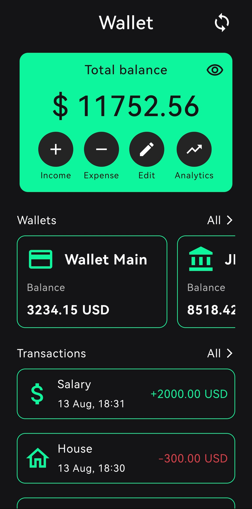
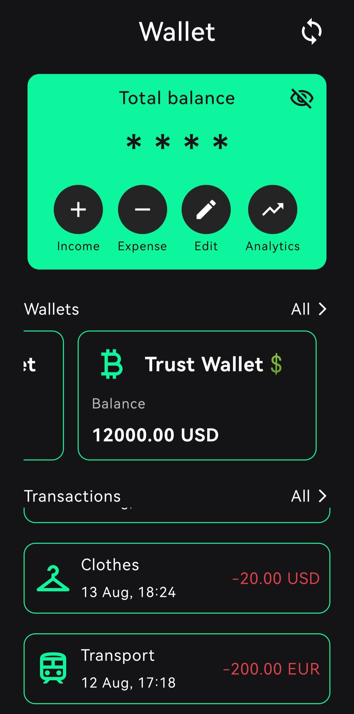
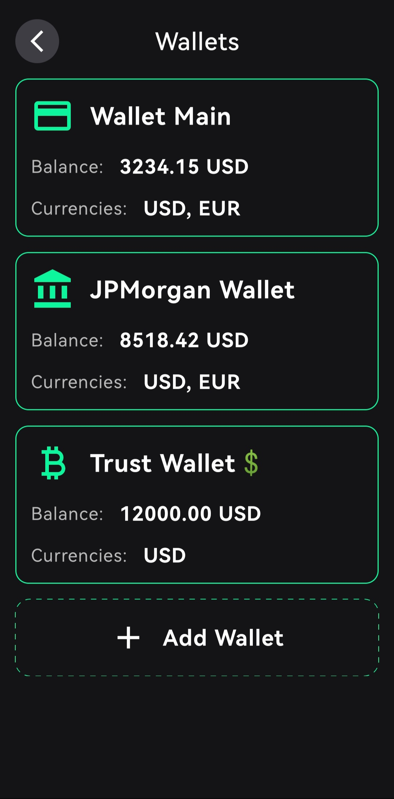
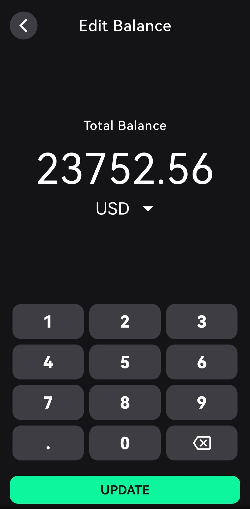

# MyWallet

MyWallet is a personal finance tracking Android app that helps to manage all your wallets in one place: cards, cash, bank accounts, crypto wallets, investments. The application helps to track transactions, monitor balances and get analytics about spending and incomes. 

## 📱 Screenshots

  
  
  

   
  
  

## ✨ Features

- ### Multiple Wallet Types
    - Cards
    - Cash
    - Bank Accounts
    - Crypto Accounts
    - Investments
 
- ### Multi-Currency Support
    - USD 
    - EUR 
    - RUB (Russian ruble) 
    - GEL (Georgian lari) 
    - KZT (Kazakhstani tenge) 

- ### Transactions
    - Add income and expense transactions.
    - Assign transactions to specific wallets and currency accounts.
    - Automatic balance calculation for each wallet and the total across all wallets.

- ### Analytics
    - View breakdowns of your finances for day/week/month/year
    - View breakdowns of your transactions for specific types and dates
    - Filter transactions for specific categories

## 🛠 Tech Stack
  - Platform: Android
  - Language: Kotlin
  - UI: Jetpack Compose
  - Storage: Room + DataStore
  - DI: Hilt
  - Network: Ktor

## 🚀 Getting Started
  1. Clone this repository:
  `` https://github.com/AntroDony/WalletApp.git ``

  2. Open in Android Studio
  3. Build and run the project on your device or emulator 

## [📥 Download APK](./github_resources/apk_file/MyWallet.apk)